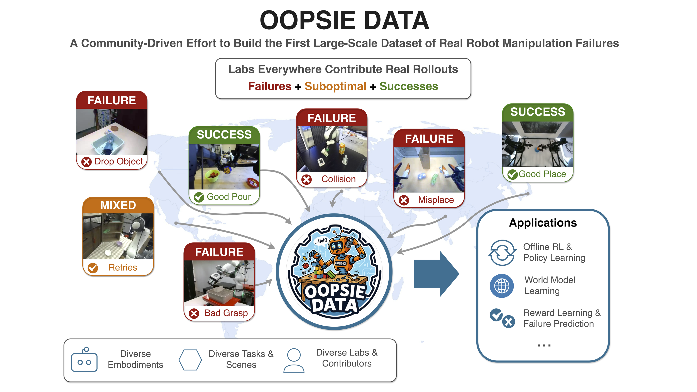

# OopsieData Tools

  

Oopsie Data is an initative to build a large-scale dataset of real robot manipulation failures (along with other mixed-quality behaviors and successes). Oopsie Data Tools helps labs record, annotate, and contribute those rollouts instead of throwing them away.

Ready to contribute? Start with the [Quickstart Guide](https://oopsie-data.com/quickstart).

For documentation, contribution instructions, and tooling guides, visit our [website](https://oopsie-data.com/).

---

This repository currently provides tools for:

- HDF5 episode recording (`EpisodeRecorder`)
- Web annotation workflows
- In-the-loop annotation during policy rollout

as well as all the necessary utilities to validate, inspect, and upload Oopsie-Data to the official repositories.

## Need help integrating?

Open an issue if you need help adding Oopsie Tools recording to your eval pipeline. Include your robot platform, policy stack, and a pointer to your evaluation/inference code.

